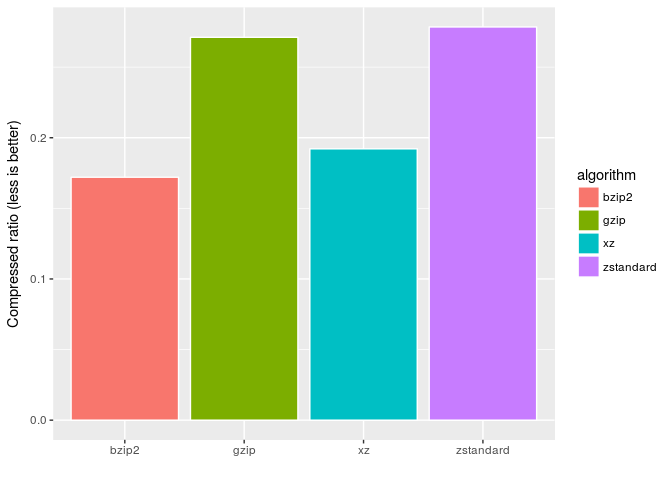
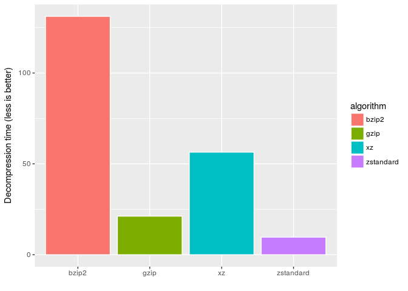
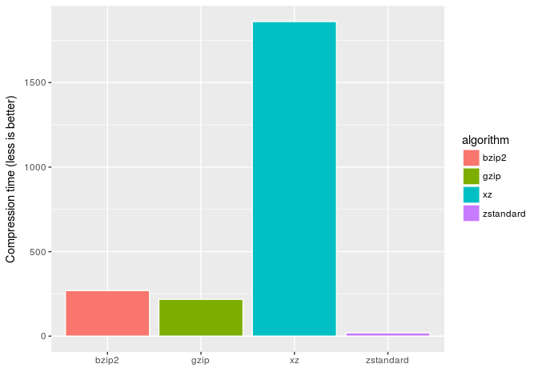

About
-----

This package provides simple R bindings to the [Zstandard compression library](http://facebook.github.io/zstd/).

Installation
------------

For the moment you can only install from GitHub:

``` r
devtools::install_github("thekvs/zstdr")
```

Usage
-----

``` r
library(zstdr)

data_file <- file.path(R.home(), "COPYING")
data <- readBin(data_file, raw(), file.info(data_file)$size)
compressed <- zstdCompress(data)
stopifnot(identical(data, zstdDecompress(compressed)))
```

Benchmarks
----------

``` r
library(zstdr)
library(ggplot2)
library(microbenchmark)

data_file <- file.path(getwd(), "tests/testthat/data.txt")
data <- readBin(data_file, raw(), file.info(data_file)$size)

y1 <- memCompress(data, "gzip")
y2 <- memCompress(data, "bzip2")
y3 <- memCompress(data, "xz")
y4 <- zstdCompress(data)
```

``` r
alldata <- data.frame (
    algorithm = c("gzip", "bzip2", "xz", "zstandard"),
    ratio = c(length(y1), length(y2), length(y3), length(y4)) / length(data)
)

ggplot(alldata, aes(x = algorithm, fill = algorithm, y = ratio)) +
    geom_bar(color = "white", stat = "identity") +
    xlab("") + ylab("Compressed ratio (less is better)")
```



``` r
bm <- microbenchmark(
    memDecompress(y1, "gzip"),
    memDecompress(y2, "bzip2"),
    memDecompress(y3, "xz"),
    zstdDecompress(y4),
    times = 100
)

alldata$decompression <- summary(bm)$mean
ggplot(alldata, aes(x = algorithm, fill = algorithm, y = decompression)) +
    geom_bar(color = "white", stat = "identity") +
    xlab("") + ylab("Decompression time (less is better)")
```



``` r
bm <- microbenchmark(
    memCompress(data, "gzip"),
    memCompress(data, "bzip2"),
    memCompress(data, "xz"),
    zstdCompress(data),
    times = 100
)

alldata$compression <- summary(bm)$mean
ggplot(alldata, aes(x = algorithm, fill = algorithm, y = compression)) +
    geom_bar(color = "white", stat = "identity") +
    xlab("") + ylab("Compression time (less is better)")
```



Links
-----

-   [zstandard official site](http://facebook.github.io/zstd/)
-   [zstandard C API documentation](http://facebook.github.io/zstd/zstd_manual.html)
